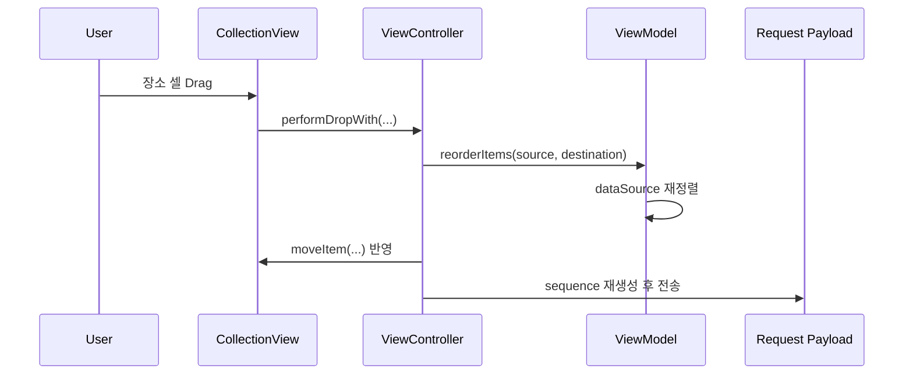

# DATEROAD (iOS 15.0+) 💘

> 쉽고 빠른 데이트로 가는 지름길 👩‍❤️‍👨
>
> - 현재 README는 psy가 개발한 내용을 중점으로 작성돼있습니다.
> - 데이트로드의 전체 README 내용은 [참조](https://github.com/TeamDATEROAD/DATEROAD-iOS)에서 확인 부탁드립니다.


<br>

## 프로젝트 정보

| 항목 | 내용 |
| --- | --- |
| 1차 스프린트 | 집중 기간: 2024.06 - 2024.07 (4주, iOS 4인) |
| 2차 스프린트 | 집중 기간: 2024.12 - 2025.02 (3주, iOS 3인) |
| 인원 | iOS 4인 협업에서 코스 등록/일정 등록 영역 등 담당 |
| 버전 | iOS 15.0+, Swift 5.0 |
| 기술 스택 | UIKit, MVVM, Custom Observable(ObservablePattern), Moya, SnapKit, Then, PHPickerViewController, Amplitude-Swift |


## 주요 기능

| 기능명 | 설명 |
| --- | --- |
| 코스 등록 3단계(AddCourse 1~3) | 이미지, 기본 정보, 장소 리스트, 상세 설명/비용을 단계적으로 검증하고 등록합니다. |
| 일정 등록 2단계(AddSchedule 1~2) | 기본 정보와 장소 리스트를 분리해 입력하고 완료 시 서버에 등록합니다. |
| 장소 검색 연동(Search Place) | 장소 검색 결과에서 선택한 장소명/주소를 등록 폼에 바인딩합니다. |
| 장소 순서 편집(Drag & Drop) | 등록한 장소를 드래그 앤 드롭으로 재정렬하고 서버 요청 순서(sequence)에 반영합니다. |
| 이미지 업로드 및 대표 이미지 지정 | 최대 10장 선택, 대표 썸네일 선택, JPEG 압축 후 multipart 업로드를 처리합니다. |
| 토큰 만료 재시도(Reissue) | 등록 API가 401을 반환하면 토큰 재발급 후 동일 흐름을 재시도합니다. |

#### 1️⃣ 코스 등록하기 및 열람

|  |  |
| ------------------------------------------------------------------------------------------------------ | ------------------------------------------------------------------------------------------------------ |

- 내가 한 데이트 코스를 등록하고 포인트를 획득할 수 있습니다.
- 다른 커플들이 한 데이트를 포인트를 사용해 열람할 수 있습니다.
- 코스 상세 페이지에서 ‘내 일정에 추가하기’ 버튼을 눌러 내 데이트 일정으로 불러올 수 있습니다.

#### 2️⃣ 일정 등록하기 및 열람

|  |  |
| ------------------------------------------------------------------------------------------------------- | ------------------------------------------------------------------------------------------------------ |

- 내 데이트 일정을 등록할 수 있습니다.
- 내 데이트 일정을 확인할 수 있습니다.
- 지난 데이트는 코스 등록하기로 연동해 등록하고 포인트를 받을 수 있습니다.
- 카카오톡 공유하기를 통해 데이트 일정을 연인에게 공유할 수 있습니다.

<br>

## 아키텍처

```mermaid
flowchart LR
  A[AddCourse / AddSchedule ViewController] --> B[ViewModel]
  B --> C[ObservablePattern 바인딩]
  C --> D[입력 검증 및 버튼 상태 제어]
  D --> E[NetworkService]
  E --> F[AddCourseService / AddScheduleService]
  F --> G[Moya TargetType]
  G --> H[API]

  H -->|401| I[BaseService.reIssueJWT]
  I --> J[Serviceable.patchReissue]
  J --> K[토큰 갱신 후 재시도]
```



## 기술적 도전과 해결

### 1. 단계별 입력 검증 게이팅(Validation Gating) - 6개/5개/2개 조건
코스 등록과 일정 등록이 다단계 폼(Multi-step Form)으로 구성되어 있기 때문에, 각 단계에서 필수 입력이 빠진 상태로 다음 단계로 넘어가면 잘못된 데이터가 누적되고 수정 비용이 커지는 문제가 있었습니다. 그래서 각 입력값 변화를 즉시 감지하면서도 단계 단위로 완료 조건을 합산하도록 설계했습니다.

**해결 방향:**
- ObservablePattern(ObservablePattern)의 `bind`/`lazyBind`로 텍스트, 날짜, 태그, 지역, 장소 수를 실시간 반영했습니다.
- `isOkSixBtn`, `isEnableNextButton`, `isSourceMoreThanOne`로 단계별 완료 조건을 분리하고 버튼 활성화를 일관되게 제어했습니다.
- ViewModel에서 검증 상태를 발행하고 View는 스타일만 반영하도록 역할을 분리했습니다.

> 코스 1단계는 6개 입력, 일정 1단계는 5개 입력, 2단계는 최소 2개 장소를 만족할 때만 다음/완료 버튼이 활성화되도록 구성했습니다.

### 2. 장소 재정렬과 서버 순서 동기화(Order Consistency) - 드래그 이동 즉시 반영
장소 편집에서 화면 순서(UI Order)만 바뀌고 데이터 순서(Data Order)가 유지되면, 사용자가 의도한 동선과 서버 저장 순서가 달라지는 문제가 발생할 수 있기 때문에 재정렬 시점에 데이터와 UI를 함께 갱신해야 했습니다.

**해결 방향:**
- `UICollectionViewDragDelegate`와 `UICollectionViewDropDelegate`를 적용해서 이동 동작을 표준 이벤트로 처리했습니다.
- `reorderItems`에서 데이터소스를 먼저 갱신하고 `performBatchUpdates`로 화면 이동을 동기화했습니다.
- POST 요청 직전에 `enumerated()` 기반으로 `sequence`를 재생성해서 최종 순서를 payload에 반영했습니다.



> 사용자가 변경한 장소 순서가 컬렉션 뷰와 요청 payload의 `sequence`에 함께 반영되도록 맞췄습니다.

### 3. 이미지 선택/썸네일/업로드 최적화(Image Pipeline) - 최대 10장, 압축 0.6
코스 등록에서 다중 이미지 선택 시 선택 순서가 바뀌거나 payload가 과도하게 커지면 등록 경험이 불안정해지기 때문에, 선택 순서 보존과 대표 이미지 지정, 업로드 크기 제어를 동시에 처리해야 했습니다.

**해결 방향:**
- `PHPickerConfiguration`에서 `selectionLimit = 10`, `selection = .ordered`를 적용해서 선택 상한과 순서를 고정했습니다.
- `selectedAssetIdentifiers`를 기준으로 이미지 배열을 재구성해서 표시 순서와 선택 순서를 일치시켰습니다.
- `AddCourseTargetType`의 multipart 업로드에서 `jpegData(compressionQuality: 0.6)`와 `thumbnailIndex`를 함께 전송했습니다.

| 관점 | 적용 전 | 적용 후 |
| --- | --- | --- |
| 이미지 순서 | 선택 순서 불일치 가능 | `selection = .ordered` + `selectedAssetIdentifiers`로 순서 고정 |
| 대표 이미지 | 별도 식별 없음 | `thumbnailIndex`로 대표 이미지 명시 |
| 업로드 데이터 | 원본 크기 의존 | `jpegData(0.6)`로 multipart 데이터 크기 최적화 |

> 최대 10장 이미지 선택, 대표 이미지 1장 지정, JPEG 압축 품질 0.6 기준 업로드 흐름으로 정리했습니다.

## 프로젝트 구조

```text
DATEROAD-iOS/
├─ Presentation/AddCourse, Presentation/AddSchedule
├─ Network/AddCourse, Network/AddSchedule, Network/Base
└─ Global/{UIComponents, Utils/ObservablePattern.swift, Protocols/Serviceable.swift}
```
